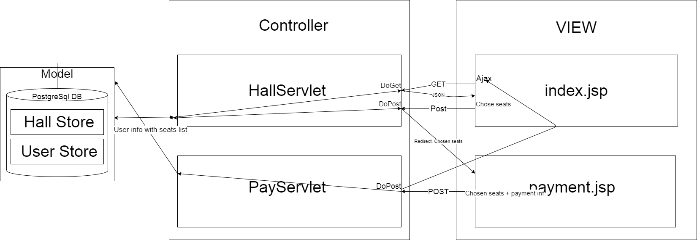
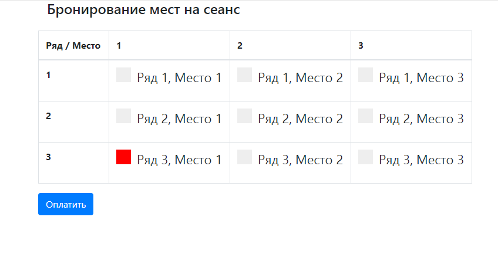
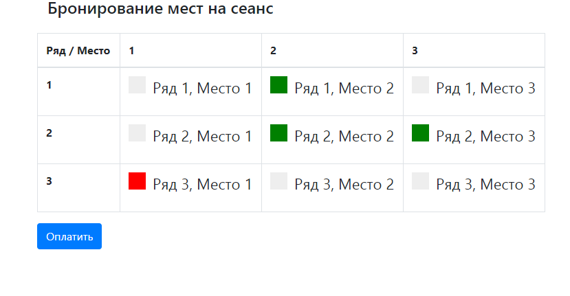
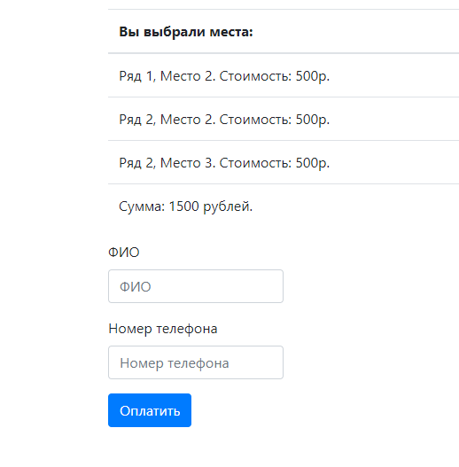
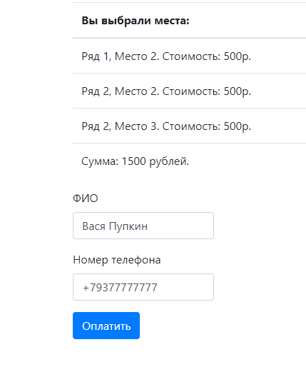
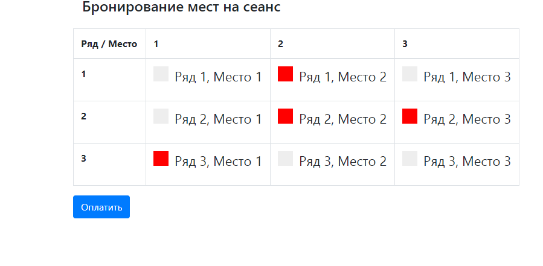

# Сервис "Кинотеатр"

* [Описание](#описание)
* [Функционал](#функционал)
* [Технологии](#технологии)
* [Архитектура](#архитектура)
* [Интерфейс](#интерфейс)
* [Документация JavaDoc](#javadoc)
* [Тесты](#тесты)
* [Автор](#автор)
* [Критика и предложения](#критика_и_предложения)

## Описание
MVC - cервис представляет собой макет онлайн-кинотеатра для выбора мест и покупки билетов.
Реализован на Servlet&JSP&AJAX

## Функционал
* Выбор мест
* Заполнение формы для бронирования(имя/email)

## Технологии
* Java14
* JDBC
* PostgreSQL
* Servlet&JSP&JSTL
* HTML, CSS, BOOTSTRAP, JS, AJAX, JQUERY
* Apache Tomcat Server
* Junit, Hamcrest, Mockito, Powermock
* Log4j, Slf4j
* HsqlDB, Mockito

## Архитектура

Проект реализован по шаблону MVC и разделён на слои:
1. Хранилища(Model)
    
    1.1 [PsqlHallStore](src/main/java/ru/job4j/cinema/store/PsqlHallStore.java) - 
    PostgreSQL хранилище для состояния кинозала. Реализует интерфейс
    [HallStore](src/main/java/ru/job4j/cinema/store/HallStore.java) со следующим функционалом:
        
        * Вернуть список всех мест кинозала (getPlaces())        
        * Вернуть коллекцию id заполненных мест (getFilledIds())
        * Вернуть место по id (getById(int id))
        * Занять места в кинозале (fillPlaces(List<Integer> placeIds))
    
    1.2 [PsqlUserStore](src/main/java/ru/job4j/cinema/store/PsqlUserStore.java) - 
    PostgreSQL хранилище для покупателей

2. JSP - View
    
    2.1 [index.jsp](src/main/webapp/index.jsp) - главная страница приложения. Функционал: 
        * Отображение кинозала. По Ajax запрашивается и приходит информация с HallServlet
          в формате JSON. Ранее выбранные места недоступны для выбора и отображаются красным
          цветом. Свободные места отображаются белым цветом и доступны для выбора.
        * Выбор мест и переход на страницу бронирования.  
    2.2 [payment.jsp](src/main/webapp/payment.jsp) - страница бронирования. После заполнения
        данных клиента, места закрепляются за ним и на главной странице будут отображаться как занятые.

3. Сервлеты - Controller

    3.1 [HallServlet](src/main/java/ru/job4j/cinema/servlet/HallServlet.java) - 
        
        * doGet метод служит для отправки данных о кинозале на index.jsp в ответ на AJAX GET - запрос.
          Формирует и передаёт данные в формате JSON.
        * doPost метод формирует и передаёт данные, а именно список выбранных мест, на
          payment.jsp
    3.2 [PayServlet](src/main/java/ru/job4j/cinema/servlet/PayServlet.java)    
        
        * doPost метод принимает данные покупателя с payment.jsp, вкупе со списком
          забронированных мест. Заносит соответствующую информацию в БД.
                       
## Интерфейс
1. Кинозал 

2. Выберем места и нажмём оплатить

3. Перешли на страницу бронирования/оплаты

 
4. Введём данные покупателя и нажмём "оплатить"

5. Видим, что места забронированы.

## JavaDoc
TODO

## Тесты
1. [PsqlHallStoreTest](src/test/java/ru/job4j/cinema/store/PsqlHallStoreTest.java) - 
   интеграционные HsqlDB тесты на PsqlHallStore
2. [HallServletTest](src/test/java/ru/job4j/cinema/servlet/HallServletTest.java) - 
   Mockito тесты на HallServlet    

## Автор

Гераськин Егор Владимирович

Java-разработчик

yegeraskin13@gmail.com

+79271506651

## Критика_и_предложения
Все замечания и пожелания по этому проекту просьба направлять мне 
на электронный адрес: yegeraskin13@gmail.com